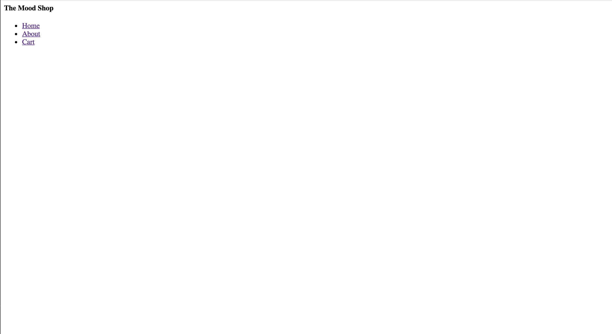

Now that we have seen how html works, let’s go ahead and start with working on our website.

Let’s start by displaying the **name** of our website and **navbar**.
We will put these two inside a ```<header>``` tag.

>[info] To learn more about header tag: [Header tag](https://www.w3schools.com/tags/tag_header.asp)

Inside our header tag, we will have ```<h4>``` tag and ```<nav>``` tag.

```<h1>...<h6>``` tags are used to define html headings.

```<h1>``` defines the most important heading. ```<h6>``` defines the least important heading.

We will use the ```<nav>``` element to define a set of navigation links.
>[info]To learn more about nav tag: [nav tag](https://www.w3schools.com/tags/tag_nav.asp)

Since we will be using lists of navigation, we will have a list tag.
>[info]To learn more about list tag: [list tag](https://www.w3schools.com/html/html_lists.asp)

The ```<ul>``` tag defines an unordered (bulleted) list.

# Adding the Header

>[action]
>
> Inside your ```index.html```, delete the ```<p>``` tag that contains 'Hello World' ,and instead add the header element along with the navbar containing the 3 links as below.
>
> Use the ```<ul>``` tag together with the ```<li>``` tag to create unordered lists.
>
>  Instead of copying and pasting the given code, type it out. This will give you more practice. 🤓
>
```html
<header class='page-header'>
    <h4>The Mood Shop</h4>
    <nav>
      <ul>
        <li><a href="#">Home</a></li>
        <li><a href="#">About</a></li>
        <li><a href="#">Cart</a></li>
      </ul>
    </nav>
  </header>
```

<!-- -->

>[action] Now refresh your html page.

Yay! You should see the name of your site, **The Mood Shop**, and 3 links.



# Update Progress on Github

>[action] Now is a great time to commit your progress.
>
```bash
git add .
git commit -m ‘made navbar skeleton’
git push
```
