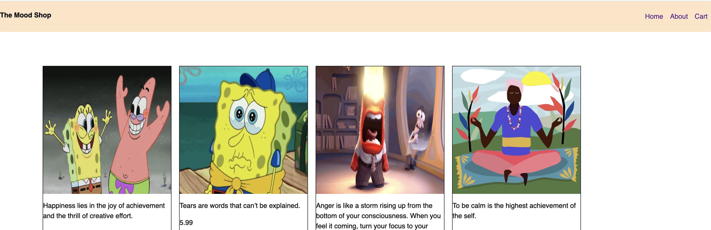

# Styling the header
Currently, our header and navbar don’t really look like a navbar at the moment. 
We need to add some styles to it.


>[action] Navigate to your project root folder and create a new folder named resources.
```bash
mkdir resources
```
This folder will hold your css, javascript and image files.

>[action] Inside your resources folder, create another folder named css. Here you will store your css files. 

```bash
cd resources
mkdir css
```

>[action] Open the css folder and create a file named styles.css. This is where all your element styles would go to.
```bash
cd css
touch styles.css
```
>[action] Now, open the styles.css file.

## Reference elements in a stylesheet
There are different ways on how to reference elements in a stylesheet. 

1. by the element tag name. 
1. by the class name. 
1. by id name  

To learn more about selectors, visit [CSS selectors](https://www.w3schools.com/css/css_selectors.asp)

# Styling the body element
The body is the first thing we want to style.
We’re going to start by styling the **font family** and **font size**. 

**Line height** - to increase spacing between lines (1.5 - 1.6) is recommended
**Font family** - there are different font families. Here we will be using Helvetica font.
**Font size** - 16 px. 

>[action] Add the following line of code to your styles.css file
```css
body{
  font-family: Helvetica;
  font-size: 16px;
  line-height: 1.5;
  margin: 0;
}
```
>[action] Now refresh your browser.

Hmm, we were expecting to see some change but don’t see any. 🤔

Can you guess why? 

>[solution] That’s because we haven’t linked our stylesheet in our HTML file.
We need to use ```<link>``` tag inside the ```<head>``` element to link our css file. 

>[action] inside the ```<head>``` element of your index.html, add the ```<link>``` element.

```html
<link rel='stylesheet' href='./resources/css/styles.css'>
```

>[action] Now go ahead and refresh your page.

Sweet! We see some font change!

We want our Webiste name to be on the left side and the navigation links (Home, about, cart) to be on the other side. For this, we will use **flexbox layout**.



# What is flexbox?

Flexbox helps to position elements inside a container. 
We set flex properties on the parent element (container) to make elements inside the container move. 

To learn more about flexbox : [Flexbox](https://www.w3schools.com/css/css3_flexbox.asp)

The flex container becomes flexible by setting the **display** property to flex.

```<Header>``` is our container so we will be setting the display property of header to flex. Inorder to refer to our header inside the css file we will be using it’s class name. 


The class name for header is '**page-header**’. 
we use dot (.) before the name when referring to class names in css files.

For example:  **.page-header**

>[action] Inside your styles.css file, add the styles for page-header.

```css
.page-header {
	display: flex;
	flex-direction: row;
	justify-content: space-between;
  background-color: bisque;
}
```

>[action] Refresh your web page again. You should see the title and navbar lists in rows. 

The navbar itself is not in rows, because the lists are inside the ```<ul>``` container. Hence we need to use flexbox on it to display the elements in rows. 

>[info] To select the ```<ul>``` tag, we can use **.page-header ul**
This will select ```<ul>``` elements inside the page-header class.

>[action] Add this code to style the navbar lists.
```css
.page-header ul{
  display: flex;
  flex-direction: row;
  justify-content: space-between;
}
```
>[action] Refresh your page again. You should now see the lists in rows. 

To remove the bullet points in each list, we can set the property list-style to none in the ```<ul>``` tag. 

>[action] Modify your **.page-header ul**

```css
.page-header ul{
  display: flex;
  flex-direction: row;
  justify-content: space-between;
  list-style: none;
}
```
The last style we need to add to the navbar is
1. adding spaces between the nav links
1. removing the underlines (text decorations) on the ```<a>``` tags. 

```css
.page-header a{
  display: block;
  padding:0.5em;
  text-decoration:none;
} 
```

# Stretch Challenge

> [challenge]
> Change the background color of the navbar
>
> Customize the navbar by changing the font size and font family to your desired choice.

Congrats! You have just made a decent looking navbar using CSS.

Now is a good time to update your progress on Github.

```bash
git add .
git commit -m ‘styled the header and navbar’
git push
```
